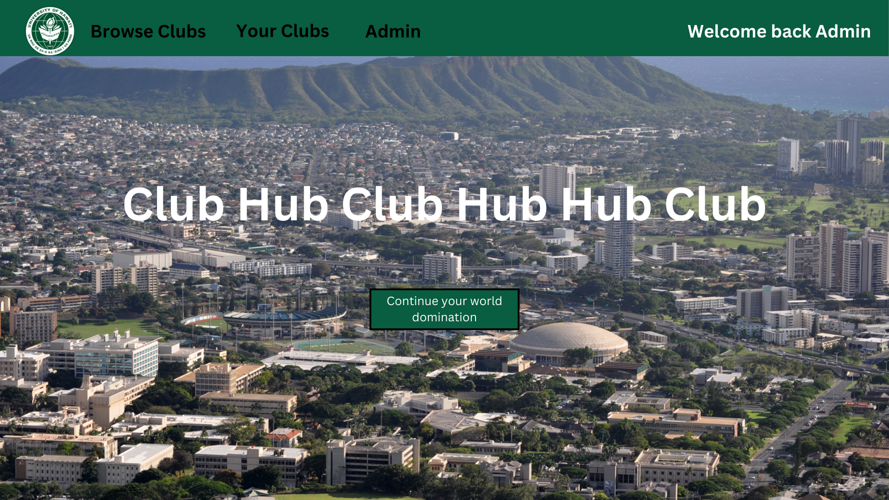
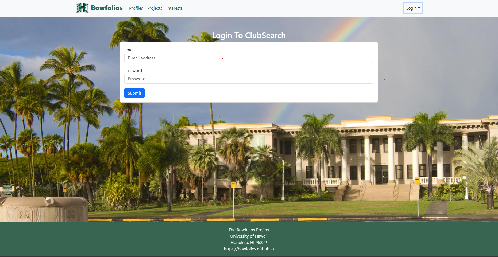
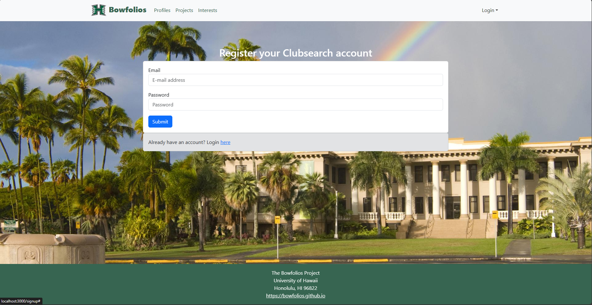

#### Search through the many diverse and interesting clubs established here on UH Manoa!

<hr style="
    border: 0;
    height: 1px;
    background-image: linear-gradient(to right, rgba(0, 0, 0, 0), 
rgba(0, 0, 0, 0.75), rgba(0, 0, 0, 0));
">

## Table of Contents
* [Overview](#overview)
* [Deployment](#deployment)
* [User Experience](#user-experience)
* [Meet the Developers](#meet-the-developers)
* [Links](#links)

## Overview
### Problem
At UH Manoa, there are over 200 [Registered Independent Organizations](https://manoa.hawaii.edu/studentlife/involvement/registered-independent-organizations/),  not including the active organizations that are not registered. However, despite this large number of organizations, there is no easy and interactive way for students to learn what kind of clubs are out there, least of all how to join them. This leads to a lack of student involvement in extracurricular activities and can affect their networking opportunities.

### Our Solution
The application, ClubSearch-Manoa, will gives students the opportunity to browse through a plethora of clubs, each detailing what they do as well as contact info and meet times. The webapp must account for club admins who wish to change what's displayed on page, as well as a super admin who can regulate the material on the site as well as convert regular users to club admins should they take on a leadership role in a club. Users will be allowed to narrow down the clubs they wish to view based off their own interests.

### Features 
The ClubSearch-Manoa project implements the following resources and technologies:
* [Meteor](https://www.meteor.com/) for Javascript-based implementation of client and server code.
* [React](https://reactjs.org/) for component-based UI implementation and routing.
* [React Bootstrap](https://react-bootstrap.github.io/) CSS Framework for UI design.
* [Uniforms](https://uniforms.tools/) for React and Semantic UI-based form design and display.


## User Experience
This section provides a quick guide through the ClubSearch-Manoa user interface.
### Landing Page
<div class="text-center p-4">
  
</div>

### Login and Sign-Up Pages

<div class="text-center p-4">
  
</div>

<div class="text-center p-4">
  
</div>

### Index Pages (Browse Clubs, Your Clubs, Admin)

<div class="text-center p-4">
  
</div>

In the sign-in page the user will be allowed to sign in wth their username and password. If they do not have login credentials, they are able to sign up. 

<div class="text-center p-4">
  
</div>

The sign up page will require the user to create a username, password, upload profile picture, and indicate their interests. 

## Deployment
### Installation
First, [install Meteor](https://www.meteor.com/install)

Next, you can access our [ClubSearch-Manoa website application GitHub page]() here. 
* From there, you can click on the "Code" dropdown, and clone the repository from there. How you clone the repo is up to you (either manually downloading the source as a zip file, forking the repo, or using [GitHub Desktop](https://desktop.github.com/) to clone it.) 

Third, cd into the clubsearch-manoa/app directory and install the libraries with: 
```angular2html
$ meteor npm install
```
After, run the system with: 
```angular2html
$ meteor npm run start
```
Finally, the application should accessible at http://localhost:3000 if all things go well. 

## Meet the Developers
* [Tyler Cho](https://github.com/tycho01) 
* [Sage Colon](https://github.com/sage-hoku)
* [Tristan Yousuf-Leo](https://github.com/tristanyousufleo) 
* [Rachel Ouye](https://github.com/rachelouye)
* [Cyril Aris](https://github.com/cyrilra)

## Links
* [ClubSearch-Manoa GitHub Organization ](https://github.com/clubsearch-manoa)
* [ClubSearch-Manoa Documentation Repo](https://github.com/clubsearch-manoa/clubsearch-manoa.github.io)
* [ClubSearch Manoa Team Contract](https://docs.google.com/document/d/13rI0D755dxqaUjztuAXejPbGeMLSq9iZsVZ2CGTJRcU/edit#heading=h.7vgabzxumypq)

